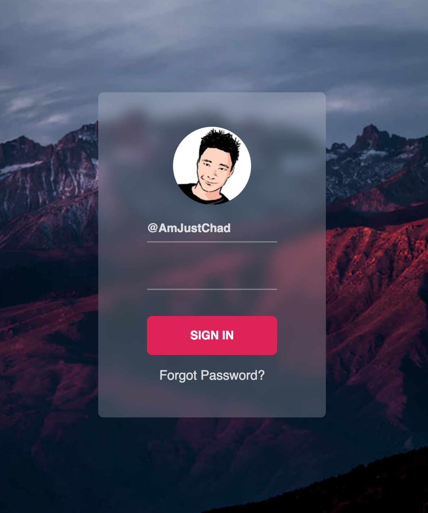

# Frosted Glass Effect - Form

In this project, we learn how to build an onboarding form. We learn how to style its background to have a cool frosted glass effect.

[Have a reference to original resource.](https://medium.com/@AmJustSam/how-to-do-css-only-frosted-glass-effect-e2666bafab91)

[View demo site here.](https://webdevtuts.github.io/frosted_glass_effect_form/)

